# 🏗️ PhotoSync — Architecture Diagram

---

# 📘 Explanation

### **Frontend (Vercel)**

* Vue.js SPA built with Vite
* Deployed automatically via GitHub integration
* Issues API requests to the backend over HTTPS

### **Backend (Google Cloud Run)**

* Laravel 12 application packaged in a Docker container
* Fully serverless and scalable
* Environment variables store DB credentials & APP_KEY

### **Database (Neon Postgres)**

* Cloud-hosted PostgreSQL instance
* SSL required
* Stores application data (e.g., messages from Contact Us form)

---

Here’s a single Markdown file containing **all three diagrams** (sequence, deployment, and roadmap) together.

You can save this as `diagrams.md` or merge into `architecture.md`.

---

# 📊 Diagrams

---

## 1. Sequence Diagram – Contact Us Flow

---

## 2. Deployment Diagram – Infrastructure & CI/CD

---

## 3. Roadmap Diagram – Build Phases

```mermaid
flowchart TD
    subgraph P1["Phase 1 – Foundation (DONE)"]
        A1["Create GitHub repo<br/>photosync"]
        A2["Setup Neon DB<br/>photosync_db"]
        A3["Setup GCP project<br/>photosync-backend-479418"]
        A4["Install Laravel 12<br/>+ .env + APP_KEY"]
        A5["Create messages table<br/>and API /api/messages"]
        A6["Create Vue 3 frontend<br/>Dashboard + Contact Us"]
        A7["Connect frontend to backend in dev<br/>VITE_API_URL=http://localhost:8000"]
        A8["Dockerize Laravel<br/>Deploy to Cloud Run"]
    end

    subgraph P2["Phase 2 – Public Release (NEXT)"]
        B1["Deploy Vue frontend to Vercel"]
        B2["Set Vercel env<br/>VITE_API_URL=Cloud Run URL"]
        B3["Test end-to-end in production<br/>Contact form → Neon DB"]
        B4["Add basic About/Status pages<br/>for visitors"]
    end

    subgraph P3["Phase 3 – Product Features (FUTURE)"]
        C1["User auth & login"]
        C2["Photoshoot booking flows"]
        C3["Admin dashboard<br/>(view messages, bookings)"]
        C4["Notifications / email integration"]
    end

    A1 --> A2 --> A3 --> A4 --> A5 --> A6 --> A7 --> A8
    A8 --> B1
    B1 --> B2 --> B3 --> B4 --> C1
    C1 --> C2 --> C3 --> C4
```

# ✔️ Current Status in Diagram Terms

* Frontend created and functional (local dev working)
* Backend deployed to Cloud Run
* Database connected and storing messages
* End-to-end connection works locally and in production
* Next: Deploy frontend to Vercel and point it to the Cloud Run API
